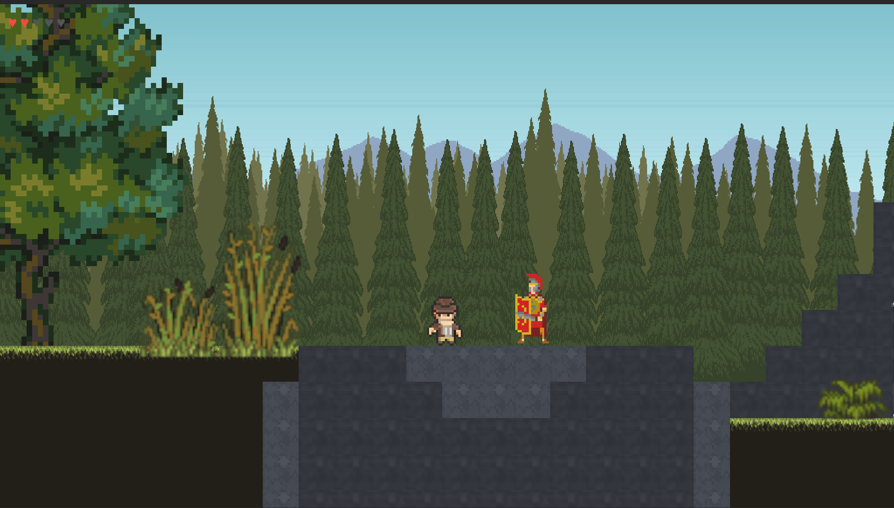
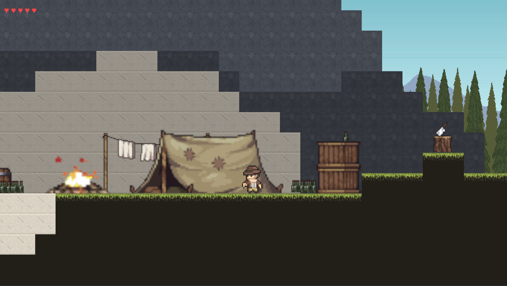

# The Gareth Odyssey
 
*A 2D pixel-art platformer bringing you through the historical eras of Crete.*
 
Play as **Gareth Owens**, archaeologist and Cretan script scholar, who recovers lost artefacts in vivid dreams of the island's past to fill his museum in modern Heraklion. This project repository delivers **Level 2 — Ancient Gortyna** as a complete, playable level taking place on Crete during its Roman era.

  <h3>▶️ <a href="https://play.unity.com/en/games/35ff710d-d7f1-42c0-83b3-dcba44b5f08b/builds">Play it in your browser</a></h3>

  

  

  

  

---
 
## Build Overview
 
This build focuses on one finished level rather than trying to implement the entire game concept. **Level 2** is realized with finished art, multiple types of enemies, player-activated checkpoints, a functional user interface (health display, difficulty setting, restart). Levels 1, 3, and 4 remain at the design stage.
 
> **Your goal:** travel through the ruins of Gortyna - from open olive groves into dense marble ruins — and recover the **Law Code of Gortyn** before your lives run out.  

<table>
  <tr>
    <td align="center" width="50%">
      
       
    </td>
    <td align="center" width="50%">
      
       
    </td>
  </tr>
</table>
 
---
 
## Gameplay
 
- **Avoidance-based gameplay** - The player has no weapons or ranged attacks. Progress depends on timing, observation, and careful navigation through encounters with the enemies.
- **Stomp option.** - Land directly on an enemy to defeat it - any other contact knocks Gareth back and costs him one life, so a mistimed stomp is just a normal hit.
- **Checkpoints (stelae).** - Walk past a stele to light it and save your spot. Fall into a pit and you respawn there, minus one life. Run out of lives and the level restarts from the beginning.
- **Historical framing.** An intro panel sets the era's context; a completion panel names and describes the recovered artefact.

  

 
*A checkpoint lights up as Gareth passes — if the player falls on a death zone, they are respawned there (without one life).*
 
---
 
## Controls
 
| Action | Input             |
|---|-------------------|
| Move | `A` / `D` or `←` / `→` |
| Jump | `Spacebar` or `↑` | 
 
---
 
## Enemies — Level 2
 
Five hand-tuned state machines that share only the contact/stomp rule:
 
- **Legionarius** — Patrols a fixed route. Raises an alert if you enter his proximity.
- **Sagittarius** — Stationary enemy that fires arrows in predictable time period. It tracks the player by turning to face them, but does not move or chase.
- **Agrios Xoiros** — Wild boar that charges in a straight line after noticing you.
- **Macrovipera** — Snake enemy that rears up and strikes in a quick forward attack, similar to the boar.  

  

---

## Difficulty
 
| Difficulty level | Lives | Notes                                                                          |
|------------------|---|--------------------------------------------------------------------------------|
| Easy             | ∞ | Explore and read the history. There is no limit to how many times you respawn. |
| Medium           | 5 | Balanced gameplay - Recommended difficulty for first playthrough               |
| Hard             | 3 | Demanding - enemy timings are also made more tough.                            |
| Impossible       | 1 | One hit results in the loss                                                   |
  
---
 
## Tech
 
- **Engine:** Unity 6.4 (6000.4.2f1), URP set up for 2D, new Input System.
- **Platform:** PC (Windows / macOS), fully offline.
---
